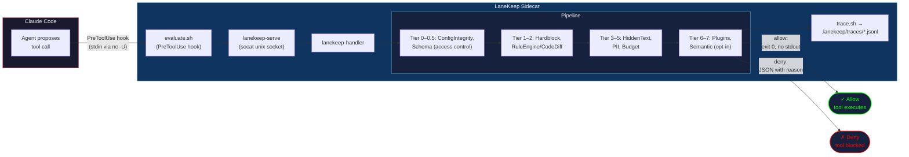

---
paths:
  - "lib/**"
  - "bin/lanekeep-handler"
  - "hooks/**"
---

# Data Flow

## Hook Protocol

- **Allow**: exit 0, no stdout
- **Deny**: exit 0, JSON with `permissionDecision: "deny"` + reason

## Config Merging

Budget limits and rules resolve through three layers (later wins):

1. **lanekeep.json** (defaults) — base rules and limits from `lanekeep/defaults/lanekeep.json`
2. **TaskSpec** — per-task overrides from `LANEKEEP_TASKSPEC_FILE` (immutable after creation)
3. **Environment variables** — `LANEKEEP_MAX_ACTIONS`, `LANEKEEP_TIMEOUT_SECONDS`, `LANEKEEP_MAX_TOKENS`, `LANEKEEP_PROFILE`

When a project has its own `lanekeep.json` with `"extends": "defaults"`, the config
loader deep-merges it with the defaults: `rule_overrides` patch by ID,
`extra_rules` append, `disabled_rules` remove by ID.
