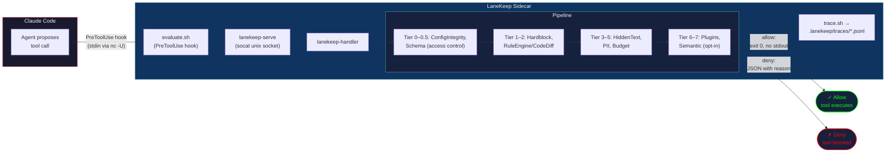

# LaneKeep — Developer Guide

## What This Is

LaneKeep is a governance guardrails and insights tool for AI coding agents (Claude Code). It intercepts tool calls
via Claude Code's PreToolUse hook, evaluates them through a tiered pipeline,
and enforces allow/deny decisions. Disabled by default — opt-in.

## Table of Contents

- [Project Layout](#project-layout)
- [Key Modules](#key-modules)
- [Data Flow](#data-flow)
- [Hook Protocol](#hook-protocol)
- [Config Merging](#config-merging)
- [Platform Coupling and Portability](#platform-coupling-and-portability)
- [Adding an Evaluator](#adding-an-evaluator)
- [Evaluator Convention](#evaluator-convention)
- [Test Commands](#test-commands)
- [Important Rules](#important-rules)

## Project Layout

```
lanekeep/
  bin/            CLI entry points (18 executables: lanekeep, lanekeep-serve,
                  lanekeep-handler, lanekeep-trace, lanekeep-audit, lanekeep-rules,
                  lanekeep-policy, lanekeep-scan, lanekeep-parse-spec, etc.)
  lib/            Evaluator modules and shared libraries
  hooks/          Claude Code hook scripts (evaluate.sh, post-evaluate.sh,
                  stop.sh, auto-format.sh, cursor-eval.sh, cursor-post-eval.sh)
  defaults/       Default config (lanekeep.json)
  ui/             Web dashboard (index.html + server.py)
    vendor/       Vendored JS libs (DOMPurify, Mermaid)
  tests/          Bats tests and fixtures (organized by category)
    config/       Config loading, integrity, layering, schema
    evaluators/   Hardblock, codediff, result-transform
    rules/        Rule patterns, custom rules, CLI, update, signing
    plugins/      Plugin commands, decisions, polyglot, webhook
    hooks/        Hook protocol, post-handler, stop, init
    pipeline/     Handler, dispatcher, concurrency, session boundary
    observability/ Trace, trace-clear, insights metrics
    ui/           Server API tests (Python)
    cli/          CLI commands, PRP parser
    fixtures/     JSON test fixtures, sample PRPs
  plugins.d/      Plugin evaluators (subshell isolated)
    examples/     Example plugins
```

## Key Modules

### Evaluators

| Module | Tier | Purpose |
|--------|-----:|---------|
| `eval-schema.sh` | 0.5 | TaskSpec allowlist/denylist — access control before content scanners |
| `eval-hardblock.sh` | 1 | Fast substring match against blocklist — always runs |
| `eval-rules.sh` | 2 | Unified rule engine — policies, first-match-wins rules |
| `eval-codediff.sh` | 2 | Legacy static pattern detection (when rules disabled) |
| `eval-hidden-text.sh` | 3 | CSS/ANSI injection, zero-width char detection |
| `eval-input-pii.sh` | 4 | Input-side PII: SSNs, credit cards, emails, phone numbers |
| `eval-budget.sh` | 5 | Action count, token tracking, wall-clock time limits |
| `eval-semantic.sh` | 7 | LLM-based intent check (opt-in, disabled by default) |
| `eval-result-transform.sh` | Post | Output masking — secrets/injection in tool results |

### Infrastructure

| Module | Purpose |
|--------|---------|
| `config.sh` | Config loader — merges defaults + project + TaskSpec + env vars |
| `dispatcher.sh` | Formats denial messages with evaluator summary |
| `trace.sh` | Append-only JSONL audit log with locking and redaction |
| `cumulative.sh` | Cross-session metrics (action count, tokens, time) |
| `license.sh` | License tier resolution (community/pro/enterprise) |
| `hooks.sh` | Hook registration and execution |
| `policy-manage.sh` | Policy enable/disable lifecycle |
| `signing.sh` | Ed25519 signature verification for rule packs |
| `sandbox.sh` | Plugin subprocess isolation |
| `scan.sh` | Plugin security scanning |
| `ralph-context.sh` | Observability event recording |

### Hooks

| Hook | Trigger | Protocol | Timeout |
|------|---------|----------|--------:|
| `evaluate.sh` | PreToolUse | JSON via socat | 5s |
| `post-evaluate.sh` | PostToolUse | JSON via socat | 10s |
| `stop.sh` | Session end | Direct | — |
| `auto-format.sh` | Post-format | Direct | — |
| `cursor-eval.sh` | Cursor PreToolUse | JSON via socat | 5s |
| `cursor-post-eval.sh` | Cursor PostToolUse | JSON via socat | 10s |

## Data Flow



## Hook Protocol

- **Allow**: exit 0, no stdout
- **Deny**: exit 0, JSON with `permissionDecision: "deny"` + reason

## Core Concepts

| Term | What it is |
|------|------------|
| **Event** | A raw tool call occurrence — one record per hook fire (`PreToolUse` or `PostToolUse`). `total_events` always increments regardless of outcome. |
| **Evaluation** | An individual check within the pipeline. Each evaluator module (`eval-hardblock.sh`, `eval-rules.sh`, `eval-budget.sh`, etc.) independently examines the event and sets `EVAL_PASSED`/`EVAL_REASON`. A single event triggers many evaluations; results recorded in the trace `evaluators[]` array with `name`, `tier`, and `passed`. |
| **Decision** | The final pipeline verdict: `allow`, `deny`, `warn`, or `ask`. Stored in the `decision` field of each trace entry and counted in `decisions.deny / warn / ask / allow` in cumulative metrics. |
| **Action** | A budget unit — an event that was *not* denied or asked. `eval-budget.sh` increments `action_count` only when `already_blocked != true` and `skip_increment != true`. Currency for `budget.max_actions` enforcement. |

```
Event (raw hook call)
  └── Evaluations (N checks run against it)
        └── Decision (single verdict: allow/deny/warn/ask)
              └── Action (counted only if allowed/warned — budget currency)
```

## Config Merging

Budget limits and rules resolve through three layers (later wins):

1. **lanekeep.json** (defaults) — base rules and limits from `lanekeep/defaults/lanekeep.json`
2. **TaskSpec** — per-task overrides from `LANEKEEP_TASKSPEC_FILE` (immutable after creation)
3. **Environment variables** — `LANEKEEP_MAX_ACTIONS`, `LANEKEEP_TIMEOUT_SECONDS`, `LANEKEEP_MAX_TOKENS`, `LANEKEEP_PROFILE`

When a project has its own `lanekeep.json` with `"extends": "defaults"`, the config
loader deep-merges it with the defaults: `rule_overrides` patch by ID,
`extra_rules` append, `disabled_rules` remove by ID.

## Platform Coupling and Portability

Seven files are Claude Code-specific (`lanekeep/hooks/evaluate.sh`,
`lanekeep/hooks/post-evaluate.sh`, `lanekeep/hooks/cursor-eval.sh`,
`lanekeep/hooks/cursor-post-eval.sh`, `lanekeep/hooks/stop.sh`,
`lanekeep/hooks/auto-format.sh`, `lanekeep/bin/lanekeep-init`). Everything else
communicates over a Unix socket with a generic JSON protocol:
`{ "tool_name": "...", "tool_input": {...} }` → `{ "decision": "allow|deny|ask|warn", "reason": "..." }`.

Porting requires: hook/interception, tool name mapping, response format
translation, and registration/init.

## Adding an Evaluator

1. Create `lanekeep/lib/eval-mycheck.sh`
2. Export globals: `MYCHECK_PASSED`, `MYCHECK_REASON`
3. Implement `mycheck_eval()` — return 0 (pass) or 1 (deny)
4. Source it in `lanekeep/bin/lanekeep-handler`
5. Wire into the pipeline after the appropriate tier
6. Add tests in `lanekeep/tests/test-mycheck.bats`

## Evaluator Convention

Each evaluator exports `EVAL_PASSED`/`EVAL_REASON` globals and an `eval_func()`
that returns 0 (pass) or 1 (deny).

## Test Commands

```bash
# Run all tests (recursive — tests are in subdirectories)
bats --recursive lanekeep/tests/

# Run a specific category
bats lanekeep/tests/pipeline/

# Run a specific test file
bats lanekeep/tests/pipeline/test-handler.bats

# Run with verbose output
bats --verbose-run lanekeep/tests/pipeline/test-handler.bats
```

## Important Rules

- All enforcement decisions are logged to JSONL trace. No silent drops.
- TaskSpec is immutable after creation.
- Evaluators return 0 (pass) or 1 (deny). Set globals before returning.
- `set -e` in bats tests catches `return 1` — use `func args || true` then check globals.
- jq `//` operator treats `false` as null — use `if has("field") then .field else default end`.

## Test Organization

| Category | Directory | Files | Scope |
|----------|-----------|------:|-------|
| Config | `tests/config/` | 4 | Loading, integrity, layering, schema |
| Evaluators | `tests/evaluators/` | 3 | Hardblock, codediff, result-transform |
| Rules | `tests/rules/` | 5 | Patterns, custom rules, CLI, update, signing |
| Plugins | `tests/plugins/` | 4 | Commands, decisions, polyglot, webhook |
| Hooks | `tests/hooks/` | 4 | Protocol, post-handler, stop, init |
| Pipeline | `tests/pipeline/` | 6 | Handler, dispatcher, concurrency, session, context |
| Observability | `tests/observability/` | 3 | Trace, trace-clear, insights metrics |
| UI | `tests/ui/` | 2 | Server API tests (Python) |
| CLI | `tests/cli/` | 2 | CLI commands, PRP parser |

## References

| Document | Purpose |
|----------|---------|
| [README.md](README.md) | User/admin reference — rules, policies, CLI, quick start |
| [REFERENCE.md](REFERENCE.md) | Full config reference — rule fields, env vars, settings |
| [CONTRIBUTING.md](CONTRIBUTING.md) | Contributor setup, workflow, PR checklist |
| [plugins.d/AUTHORING.md](plugins.d/AUTHORING.md) | Plugin contract — Bash and polyglot |

---

<div align="center">

### Interested in building with us?

<table><tr><td>
<p align="center">
<strong>We are looking for ambitious engineers to help us extend the capabilities of LaneKeep.</strong><br/>
Is this you? <strong>Get in touch →</strong> <a href="mailto:info@algorismo.com"><code>info@algorismo.com</code></a>
</p>
</td></tr></table>

</div>
