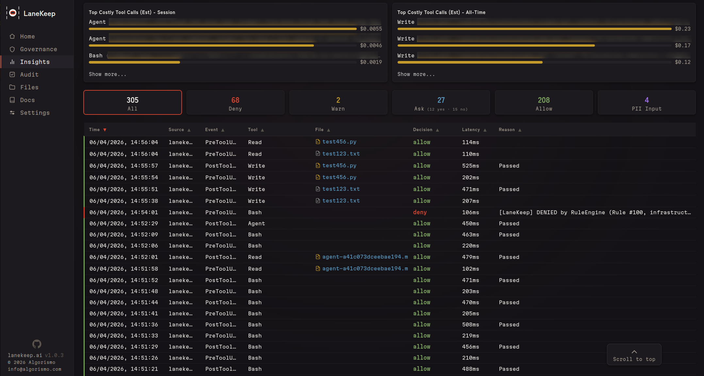
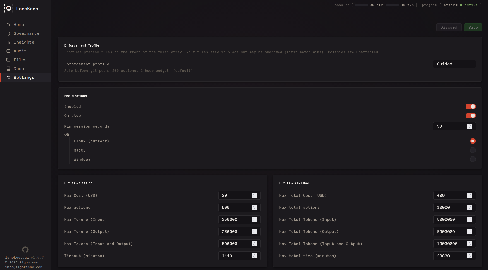
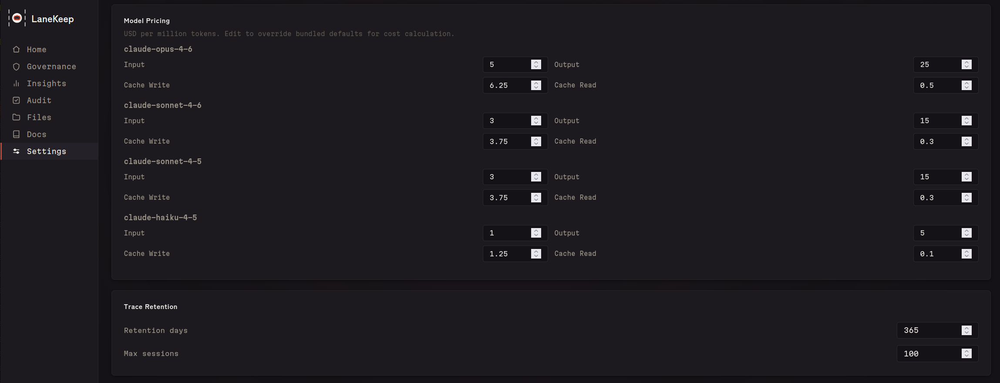
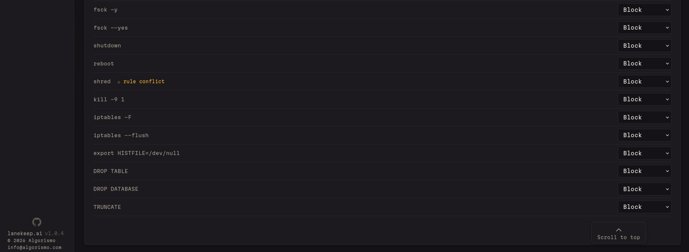

<p align="center">
  <picture>
    <source media="(prefers-color-scheme: dark)" srcset="images/lanekeep-logo-mark.svg" />
    <source media="(prefers-color-scheme: light)" srcset="images/lanekeep-logo-mark-light.svg" />
    
  </picture>
</p>

<p align="center">
  <a href="LICENSE"></a>
  <a href="https://github.com/algorismo-au/lanekeep/actions/workflows/test.yml"></a>
  
  
  
  
</p>

<p align="center">
  <a href="README.md">English</a> ·
  <a href="README.zh-CN.md">简体中文</a> ·
  <a href="README.ja.md">日本語</a> ·
  <a href="README.es.md">Español</a> ·
  <a href="README.ko.md">한국어</a> ·
  <a href="README.pt-BR.md">Português</a> ·
  <a href="README.de.md">Deutsch</a> ·
  <a href="README.fr.md">Français</a> ·
  <a href="README.ru.md">Русский</a>
</p>

# LaneKeep

LaneKeepは、AIコーディングエージェントをあなたが管理する境界内で動作させるためのツールです。

**データがマシンの外に出ることはありません。**

**すべてのポリシーとルールはあなたが管理します。**

- **ライブダッシュボード** — すべての判定をローカルに記録
- **予算制限** — 使用パターン、コスト上限、トークンおよびアクション制限
- **完全な監査証跡** — すべてのツール呼び出しを、一致したルールと理由とともに記録
- **多層防御** — 拡張可能なポリシーレイヤー：9つ以上の決定論的評価器と、オプションのセマンティックレイヤー（別のLLM）を評価器として使用可能。PII検出、設定整合性チェック、インジェクション検出
- **エージェントのメモリ・ナレッジビュー** — エージェントが見ているものを確認
- **カバレッジとアラインメント** — 組み込みのコンプライアンスタグ（NIST、OWASP、CWE、ATT&CK）に加え、独自タグも追加可能

Claude Code CLI対応。その他のプラットフォームも近日対応予定。

詳細は[設定](#設定)を参照してください。

<p align="center">
  
</p>

## クイックスタート

### 前提条件

| 依存関係 | 必須 | 備考 |
|----------|------|------|
| **bash** >= 4 | はい | コアランタイム |
| **jq** | はい | JSON処理 |
| **socat** | サイドカーモードの場合 | フックのみのモードでは不要 |
| **Python 3** | 任意 | Webダッシュボード（`lanekeep ui`） |

```bash
sudo apt install jq socat        # Debian/Ubuntu
brew install bash jq socat       # macOS (bash 4+ required)
```

### インストール

```bash
git clone https://github.com/algorismo-au/lanekeep.git
cd lanekeep
```

`bin/` をPATHに恒久的に追加：

```bash
bash scripts/add-to-path.sh
```

シェルを検出し、rcファイルに書き込みます。冪等です。

または、現在のセッションのみの場合：

```bash
export PATH="$PWD/bin:$PATH"
```

ビルドステップは不要。純粋なBashです。

### 1. デモを試す

```bash
lanekeep demo
```

```
  DENIED  rm -rf /              Recursive force delete
  DENIED  DROP TABLE users      SQL destruction
  DENIED  git push --force      Dangerous git operation
  ALLOWED ls -la                Safe directory listing
  Results: 4 denied, 2 allowed
```

### 2. プロジェクトにインストール

```bash
cd /path/to/your/project
lanekeep init .
```

`lanekeep.json`、`.lanekeep/traces/` を作成し、`.claude/settings.local.json` にフックをインストールします。

### 3. LaneKeepを起動

```bash
lanekeep start       # sidecar + web dashboard
lanekeep serve       # sidecar only
# or skip both — hooks evaluate inline (slower, no background process)
```

### 4. エージェントを通常通り使用

拒否されたアクションには理由が表示されます。許可されたアクションは静かに実行されます。判定は**[ダッシュボード](#ダッシュボード)**（`lanekeep ui`）またはターミナルで `lanekeep trace` / `lanekeep trace --follow` を使用して確認できます。

| | |
|:---:|:---:|
|  |  |
|  |  |
|  |  |

---

## LaneKeepの管理

### 有効化と無効化

`lanekeep init` はフックを自動的に登録しますが、フック登録を独立して管理することもできます：

```bash
lanekeep enable          # Register hooks in Claude Code settings
lanekeep disable         # Remove hooks from Claude Code settings
lanekeep status          # Check if LaneKeep is active and show governance state
```

**`enable` または `disable` 後、変更を反映するにはClaude Codeを再起動してください。**

`enable` は3つのフック（PreToolUse、PostToolUse、Stop）をClaude Codeの設定ファイルに書き込みます。プロジェクトローカルの `.claude/settings.local.json` が存在する場合はそこに、存在しない場合は `~/.claude/settings.json` に書き込みます。`disable` はそれらをクリーンに削除します。

### 起動と停止

フックだけでも動作します — すべてのツール呼び出しがインラインで評価されます。サイドカーは高速な評価のための常駐バックグラウンドプロセスとWebダッシュボードを追加します：

```bash
lanekeep start           # Sidecar + web dashboard (recommended)
lanekeep serve           # Sidecar only (no dashboard)
lanekeep stop            # Shut down sidecar and dashboard
lanekeep status          # Check running state
```

### LaneKeepの一時的な無効化

「無効化」には2つのレベルがあります：

| 範囲 | コマンド | 動作 |
|------|---------|------|
| **システム全体** | `lanekeep disable` | すべてのフックを削除 — 評価が行われなくなります。Claude Codeを再起動してください。 |
| **単一ポリシー** | `lanekeep policy disable <category> --reason "..."` | 単一のポリシーカテゴリ（例：`governance_paths`）を無効化し、他のすべては引き続き適用されます。 |

単一ポリシーを一時停止して再度有効化する場合：

```bash
lanekeep policy disable governance_paths --reason "Updating CLAUDE.md"
# ... make changes ...
lanekeep policy enable governance_paths
```

LaneKeepを完全に無効化し、元に戻す場合：

```bash
lanekeep disable         # Remove hooks — restart Claude Code
# ... work without governance ...
lanekeep enable          # Re-register hooks — restart Claude Code
```

---

## ブロック対象

オーバーライド、拡張、または無効化については[設定](#設定)を参照してください。

| カテゴリ | 例 | 判定 |
|----------|------|------|
| 破壊的操作 | `rm -rf`、`DROP TABLE`、`truncate`、`mkfs` | deny |
| IaC / クラウド | `terraform destroy`、`aws s3 rm`、`helm uninstall` | deny |
| 危険なgit操作 | `git push --force`、`git reset --hard` | deny |
| コード内のシークレット | AWSキー、APIキー、秘密鍵 | deny |
| ガバナンスファイル | `claude.md`、`.claude/`、`lanekeep.json`、`.lanekeep/`、`plugins.d/` | deny |
| 自己保護 | `kill lanekeep-serve`、`export LANEKEEP_FAIL_POLICY` | deny |
| ネットワークコマンド | `curl`、`wget`、`ssh` | ask |
| パッケージインストール | `npm install`、`pip install` | ask |

### 自己保護

LaneKeepは、管理対象のエージェントによる自身およびエージェントのガバナンスファイルの変更から保護します。この仕組みがなければ、侵害されたりプロンプトインジェクションを受けたエージェントが、適用の無効化、監査ログの改ざん、予算制限のバイパスを行う可能性があります。

| パス | 保護対象 |
|------|---------|
| `claude.md`、`.claude/` | Claude Codeの指示、設定、フック、メモリ |
| `lanekeep.json`、`.lanekeep/` | LaneKeepの設定、ルール、トレース、ランタイム状態 |
| `lanekeep/bin/`、`lib/`、`hooks/` | LaneKeepのソースコード |
| `plugins.d/` | プラグイン評価器 |

**書き込み**は `governance_paths` ポリシー（Write/Editツール）によってブロックされます。
**読み取り**については、アクティブな設定（`lanekeep.json`、`.lanekeep/` の状態ファイル）がルール `sec-039` と `sec-040` によってブロックされます。ルールセットを公開するとエージェントがマッチパターンをリバースエンジニアリングして回避策を作成できてしまうためです。LaneKeepのソースコード（`bin/`、`lib/`）は読み取り可能なままです。エンジンのセキュリティはオープンですが、アクティブな設定は管理対象のエージェントには不透明です。詳細は [REFERENCE.md](REFERENCE.md#self-protection-governance_paths--rules) を参照してください。

---

## 仕組み

[PreToolUseフック](https://docs.anthropic.com/en/docs/claude-code/hooks)にフックし、すべてのツール呼び出しを実行前に段階的なパイプラインで処理します。最初のdenyでパイプラインは停止します。

| 段階 | 評価器 | チェック内容 |
|------|--------|-------------|
| 0 | Config Integrity | 起動時から設定ハッシュが変更されていないこと |
| 0.5 | Schema | TaskSpecの許可リスト/拒否リストに対するツールチェック |
| 1 | Hardblock | 高速な部分文字列マッチ — 常に実行 |
| 2 | Rules Engine | ポリシー、先行一致方式のルール |
| 3 | Hidden Text | CSS/ANSIインジェクション、ゼロ幅文字 |
| 4 | Input PII | ツール入力中のPII（SSN、クレジットカード） |
| 5 | Budget | アクション数、トークン追跡、コスト制限、経過時間 |
| 6 | Plugins | カスタム評価器（サブシェルで隔離） |
| 7 | Semantic | LLMによる意図チェック — 目標の不整合、タスク趣旨の違反、偽装された外部送信の検出（オプトイン） |
| Post | ResultTransform | 出力中のシークレット/インジェクション |

セマンティック評価器はTaskSpecからタスク目標を読み取ります。`lanekeep serve --spec DESIGN.md` で設定するか、`.lanekeep/taskspec.json` に直接記述します。
詳細は [REFERENCE.md](REFERENCE.md#budget--taskspec) を参照してください。

段階の詳細説明とデータフローについては [CLAUDE.md](CLAUDE.md) を参照してください。

## コアコンセプト

| 用語 | 説明 |
|------|------|
| **イベント** | 未加工のツール呼び出し発生 — フック発火（`PreToolUse` または `PostToolUse`）ごとに1レコード。`total_events` は結果に関わらず常にインクリメントされます。 |
| **評価** | パイプライン内の個々のチェック。各評価器モジュール（`eval-hardblock.sh`、`eval-rules.sh`、`eval-budget.sh` など）が独立してイベントを検査し、`EVAL_PASSED`/`EVAL_REASON` を設定します。1つのイベントが多数の評価をトリガーします。結果はトレースの `evaluators[]` 配列に `name`、`tier`、`passed` とともに記録されます。 |
| **判定** | パイプラインの最終結果：`allow`、`deny`、`warn`、`ask` のいずれか。各トレースエントリの `decision` フィールドに格納され、累積メトリクスの `decisions.deny / warn / ask / allow` でカウントされます。 |
| **アクション** | ツールが実際に実行されたイベント（`allow` または `warn`）。拒否されたものやask待ちの呼び出しはカウントされません。`action_count` は `budget.max_actions` の測定対象であり、上限に達すると予算評価器がブロックを開始します。 |

```
Event (raw hook call)
  └── Evaluations (N checks run against it)
        └── Decision (single verdict: allow/deny/warn/ask)
              └── Action (only if tool actually ran — counts against max_actions)
```

---

## 設定

すべて設定可能です — 組み込みデフォルト、ユーザー定義ルール、コミュニティ提供のパックがすべて単一のポリシーにマージされます。任意のデフォルトをオーバーライドしたり、独自のルールを追加したり、不要なものを無効化したりできます。

設定の解決順序：`$PROJECT_DIR/lanekeep.json` -> `$LANEKEEP_DIR/defaults/lanekeep.json`
設定は起動時にハッシュチェックされます — セッション中の変更はすべての呼び出しを拒否します。

### ポリシー

ルールの前に評価されます。20の組み込みカテゴリ — それぞれに専用の抽出ロジックがあります（例：`domains` はURLを解析、`branches` はgitブランチ名を抽出）。
カテゴリ：`tools`、`extensions`、`paths`、`commands`、`domains`、`mcp_servers` など。`lanekeep policy` またはダッシュボードの**ガバナンス**タブで切り替え可能です。

**ポリシーとルールの違い：** ポリシーは、定義済みカテゴリ向けの構造化された型付き制御です。ルールは柔軟な汎用手段で、任意のツール名 + 任意の正規表現パターンをツール入力全体に対してマッチさせます。ポリシーカテゴリに当てはまらないユースケースには、ルールを記述してください。

ポリシーを一時的に無効化する場合（例：`CLAUDE.md` の更新時）：

```bash
lanekeep policy disable governance_paths --reason "Updating CLAUDE.md"
# ... make changes ...
lanekeep policy enable governance_paths
```

### ルール

順序付きの先行一致方式テーブル。一致なし = 許可。マッチフィールドはANDロジックを使用します。

```json
[
  {"match": {"command": "rm", "target": "node_modules"}, "decision": "allow"},
  {"match": {"command": "rm -rf"},                        "decision": "deny"}
]
```

デフォルト全体をコピーする必要はありません。`"extends": "defaults"` を使用して独自のルールを追加できます：

```json
{
  "extends": "defaults",
  "extra_rules": [
    {
      "id": "my-001",
      "match": { "command": "docker compose down" },
      "decision": "deny",
      "reason": "Block tearing down the dev stack"
    }
  ]
}
```

またはCLIを使用：

```bash
lanekeep rules add --match-command "docker compose down" --decision deny --reason "..."
```

ルールはダッシュボードの**ルール**タブでも追加、編集、ドライラン可能です。またはCLIで先にテストできます：

```bash
lanekeep rules test "docker compose down"
```

### LaneKeepの更新

新しいバージョンのLaneKeepをインストールすると、新しいデフォルトルールは自動的に有効になります — **あなたのカスタマイズ（`extra_rules`、`rule_overrides`、`disabled_rules`）には一切影響しません**。

アップグレード後の初回サイドカー起動時に、一度だけ通知が表示されます：

```
[LaneKeep] Updated: v1.2.0 → v1.3.0 — 8 new default rule(s) now active.
[LaneKeep] Run 'lanekeep rules whatsnew' to review. Your customizations are preserved.
```

具体的な変更内容を確認するには：

```bash
lanekeep rules whatsnew
# Shows new/removed rules with IDs, decisions, and reasons

lanekeep rules whatsnew --skip net-019   # Opt out of a specific new rule
lanekeep rules whatsnew --acknowledge    # Record current state (clears future notices)
```

> **モノリシック設定を使用している場合**（`"extends": "defaults"` なし）、新しいデフォルトルールは
> 自動的にマージされません。`lanekeep migrate` を実行して、すべてのカスタマイズを維持したまま
> レイヤード形式に変換してください。

### 適用プロファイル

| プロファイル | 動作 |
|-------------|------|
| `strict` | Bashを拒否、Write/Editは確認。500アクション、2.5時間。 |
| `guided` | `git push` は確認。2000アクション、10時間。**（デフォルト）** |
| `autonomous` | 寛容、予算 + トレースのみ。5000アクション、20時間。 |

`LANEKEEP_PROFILE` 環境変数または `lanekeep.json` の `"profile"` で設定します。

ルールフィールド、ポリシーカテゴリ、設定、環境変数の詳細は [REFERENCE.md](REFERENCE.md) を参照してください。

---

## CLIリファレンス

完全なコマンド一覧は [REFERENCE.md — CLI Reference](REFERENCE.md#cli-reference) を参照してください。

---

## ダッシュボード

エージェントがビルド中に何をしているかを正確に確認できます — ライブ判定、トークン使用量、ファイルアクティビティ、監査証跡を一箇所で表示。

### ガバナンス

入出力トークンカウンター、コンテキストウィンドウ使用率（%）、予算進捗バーをリアルタイム表示。時間とコストを浪費する前に、セッションが脱線しかけていることを検知し、アクション、トークン、時間にハードキャップを設定して自動適用できます。

<p align="center">
  
</p>

### インサイト

ライブの判定フィード、拒否トレンド、ファイルごとのアクティビティ、レイテンシパーセンタイル、セッション全体の判定タイムライン。

<p align="center">
  
</p>
<p align="center">
  
</p>
<p align="center">
  
</p>

### 監査とカバレッジ

ワンクリックの設定バリデーションに加え、ルールを規制フレームワーク（PCI-DSS、HIPAA、GDPR、NIST SP800-53、SOC2、OWASP、CWE、AU Privacy Act）にマッピングするカバレッジマップ。ギャップのハイライトとルール影響度分析を含みます。

<p align="center">
  
</p>
<p align="center">
  
</p>
<p align="center">
  
</p>

### ファイル

エージェントが読み書きするすべてのファイルを表示。ファイルごとのトークンサイズでコンテキストウィンドウを消費しているものが一目瞭然。操作回数、拒否履歴、インラインエディタも備えています。

<p align="center">
  
</p>

### 設定

適用プロファイルの設定、ポリシーの切り替え、予算制限の調整 — すべてダッシュボードから操作可能。サイドカーを再起動することなく、変更は即座に反映されます。

<p align="center">
  
</p>
<p align="center">
  
</p>
<p align="center">
  
</p>

---

## セキュリティ

**LaneKeepは完全にあなたのマシン上で動作します。クラウドなし、テレメトリなし、アカウント不要。**

- **設定整合性** — 起動時にハッシュチェック。セッション中の変更はすべての呼び出しを拒否
- **フェイルクローズド** — 評価エラーが発生した場合はすべて拒否
- **不変のTaskSpec** — セッション契約は起動後に変更不可
- **プラグインのサンドボックス化** — サブシェル隔離、LaneKeep内部へのアクセス不可
- **追記専用の監査ログ** — エージェントはトレースログを改変不可
- **ネットワーク依存なし** — 純粋なBash + jq、サプライチェーンなし

脆弱性の報告については [SECURITY.md](SECURITY.md) を参照してください。

---

## 開発

アーキテクチャと規約については [CLAUDE.md](CLAUDE.md) を参照してください。テストは `bats tests/` または `lanekeep selftest` で実行できます。Cursorアダプターも同梱されています（未テスト）。

---

## ライセンス

[Apache License 2.0](LICENSE)

---

## Keywords

AI agent guardrails, AI agent governance, AI coding agent security, agentic AI
security, vibe coding security, AI agent policy engine, governance sidecar, AI
agent firewall, AI agent audit trail, AI agent least privilege, AI agent
sandboxing, prompt injection prevention, MCP security, MCP guardrails, Claude
Code security, Claude Code guardrails, Claude Code hooks, Cursor guardrails,
Copilot governance, Aider guardrails, AI agent monitoring, AI agent
observability, AI coding assistant safety, policy-as-code, governance-as-code,
AI agent runtime security, AI agent access control, AI agent permissions, AI
agent allowlist denylist, OWASP agentic top 10, NIST AI risk management, SOC2
AI compliance, HIPAA AI compliance, EU AI Act compliance tools, PII detection,
secrets detection, AI agent budget limits, token budget enforcement, AI agent
cost control, shadow AI governance, AI development guardrails, DevSecOps AI, AI
agent command blocking, AI agent file access control, defense in depth AI, zero
trust AI agents, fail-closed security, append-only audit log, deterministic
guardrails, rule engine AI, compliance automation AI, AI agent behavior
monitoring, AI agent risk management, open source AI governance, CLI guardrails
tool, shell-based policy engine, no-cloud AI security, zero network calls, AI
coding tool audit log

---

<div align="center">

### 一緒に開発しませんか？

<table><tr><td>
<p align="center">
<strong>LaneKeepの機能を拡張する意欲的なエンジニアを募集しています。</strong><br/>
あなたのことですか？ <strong>お問い合わせ &rarr;</strong> <a href="mailto:info@algorismo.com"><code>info@algorismo.com</code></a>
</p>
</td></tr></table>

</div>
