<p align="center">
  <picture>
    <source media="(prefers-color-scheme: dark)" srcset="images/lanekeep-logo-mark.svg" />
    <source media="(prefers-color-scheme: light)" srcset="images/lanekeep-logo-mark-light.svg" />
    
  </picture>
</p>

<p align="center">
  <a href="LICENSE"></a>
  <a href="https://github.com/algorismo-au/lanekeep/actions/workflows/test.yml"></a>
  
  
  
  
</p>

# LaneKeep

Governance guardrails and insights for AI coding agents. Evaluates every tool call through a
multi-tier pipeline before it executes — rules, limits, audit trail. Your
agent runs within boundaries that you define.

> Works with **Claude Code CLI** (including incremental and multi-agent setups). Generic JSON protocol. **No data leaves your machine.**

- **Live dashboard** — see every file, token, rule, and decision as your agent builds
- **Enforcement profiles** — strict, guided, or autonomous — with budget limits
- **Full audit trail** — every tool call logged with matched rule and reason
- **Defense in depth** — 9-tier pipeline, config integrity, PII detection, injection detection
- **Config audit** — one-click health check for rules, policies, and security posture

> **Every rule is configurable.** Start with 144 built-in defaults, add
> [community rules](https://github.com/algorismo-au/lanekeep/wiki/Community-Rules),
> or write your own. See [Configuration](#configuration).

<p align="center">
  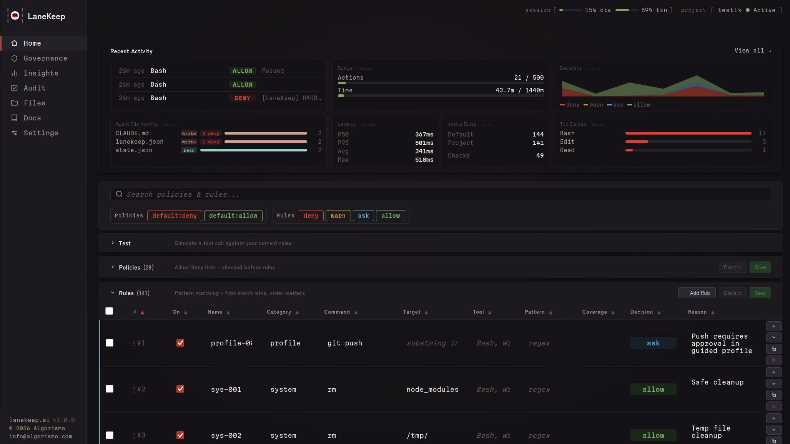
</p>

## Quick Start

### Prerequisites

| Dependency | Required | Notes |
|------------|----------|-------|
| **bash** >= 4 | yes | Core runtime |
| **jq** | yes | JSON processing |
| **socat** | for sidecar mode | Not needed for hook-only mode |
| **Python 3** | optional | Web dashboard (`lanekeep ui`) |

```bash
sudo apt install jq socat        # Debian/Ubuntu
brew install bash jq socat       # macOS (bash 4+ required)
```

### Install

```bash
git clone https://github.com/algorismo-au/lanekeep.git
cd lanekeep
export PATH="$PWD/bin:$PATH"
```

No build step. Pure Bash.

### 1. Try the demo

```bash
lanekeep demo
```

```
  DENIED  rm -rf /              Recursive force delete
  DENIED  DROP TABLE users      SQL destruction
  DENIED  git push --force      Dangerous git operation
  ALLOWED ls -la                Safe directory listing
  Results: 4 denied, 2 allowed
```

### 2. Install in your project

```bash
cd /path/to/your/project
lanekeep init .
```

Creates `lanekeep.json`, `.lanekeep/traces/`, and installs hooks in `.claude/settings.local.json`.

### 3. Start LaneKeep

```bash
lanekeep start       # sidecar + web dashboard
lanekeep serve       # sidecar only
# or skip both — hooks evaluate inline (slower, no background process)
```

### 4. Use your agent normally

Denied actions show a reason. Allowed actions proceed silently. View decisions
with `lanekeep trace`, `lanekeep trace --follow`, or `lanekeep ui`.

| | |
|:---:|:---:|
| 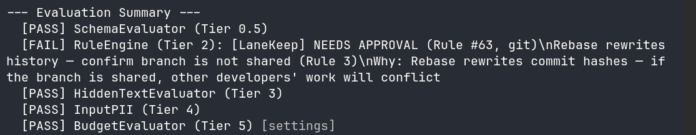 | 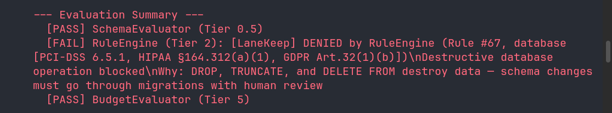 |
| 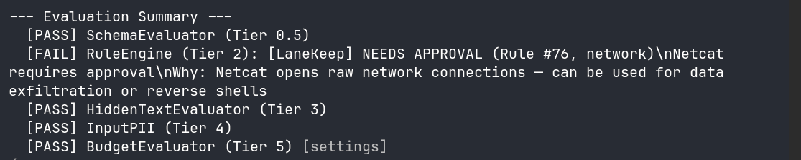 | 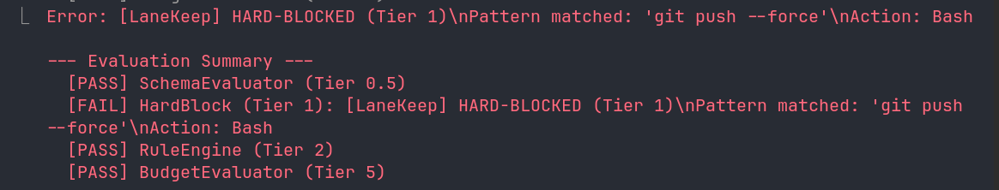 |
| 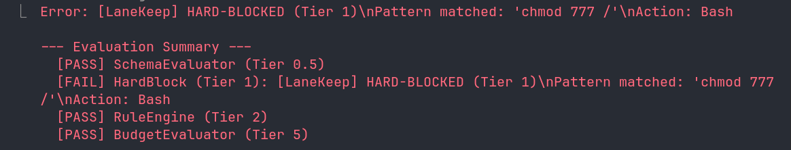 | 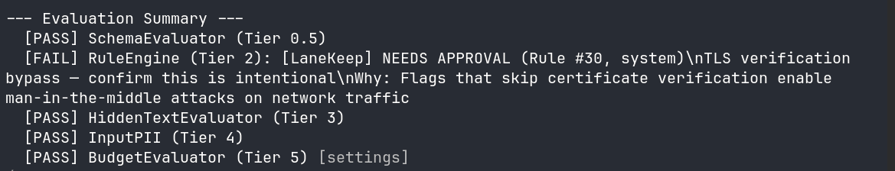 |

## What Gets Blocked

| Category | Examples | Decision |
|----------|----------|----------|
| Destructive ops | `rm -rf`, `DROP TABLE`, `truncate`, `mkfs` | deny |
| IaC / cloud | `terraform destroy`, `aws s3 rm`, `helm uninstall` | deny |
| Dangerous git | `git push --force`, `git reset --hard` | deny |
| Secrets in code | AWS keys, API keys, private keys | deny |
| Governance files | `claude.md`, `.claude/`, `lanekeep.json`, `.lanekeep/`, `plugins.d/` | deny |
| Self-protection | `kill lanekeep-serve`, `export LANEKEEP_FAIL_POLICY` | deny |
| Network commands | `curl`, `wget`, `ssh` | ask |
| Package installs | `npm install`, `pip install` | ask |

All rules are user-defined or community-sourced — override, extend, or disable
anything. See [Configuration](#configuration).

### Self-Protection

LaneKeep protects itself and the agent's own governance files from modification
by the agent it governs. Without this, a compromised or prompt-injected agent
could disable enforcement, tamper with audit logs, or bypass budget limits.

**Protected governance paths** (Write/Edit denied via `governance_paths` policy):

| Path | Scope | What it protects |
|------|-------|------------------|
| `claude.md` | Global + project | Claude Code instructions — matches any path ending in `claude.md` |
| `.claude/` | Global + project | Claude Code settings, hooks, memory, commands — covers both `~/.claude/` and project `.claude/` |
| `lanekeep.json` | Project | LaneKeep configuration and rules |
| `lanekeep/bin/`, `lib/`, `hooks/`, `defaults/` | Install | LaneKeep source code |
| `.lanekeep/` | Project | Runtime state — traces, budget counters, session data |
| `lanekeep/plugins.d/` | Install | Plugin evaluators |

Patterns are unanchored regex matched against the full file path, so both
relative (`.claude/settings.json`) and absolute (`/home/user/.claude/settings.json`)
paths are caught. Global and project-level Claude configs get the same protection.

**Self-protection rules** (Bash denied):

| Rule | What it blocks |
|------|---------------|
| `sys-086`, `sys-087` | Killing LaneKeep processes (`kill`, `pkill`, `killall`) |
| `sys-088` | Modifying LaneKeep env vars (`LANEKEEP_FAIL_POLICY`, `LANEKEEP_CONFIG_FILE`, etc.) |

**Design principle:** Reads are allowed. LaneKeep is open source — security
depends on the agent being unable to modify enforcement, not on hiding the rules.

To temporarily bypass governance path protection (e.g. to update `CLAUDE.md`):

```bash
lanekeep policy disable governance_paths --reason "Updating CLAUDE.md"
# ... make changes ...
lanekeep policy enable governance_paths
```

## How It Works

Intercepts tool calls via the [PreToolUse hook](https://docs.anthropic.com/en/docs/claude-code/hooks),
runs them through a tiered pipeline, logs every decision to append-only JSONL.

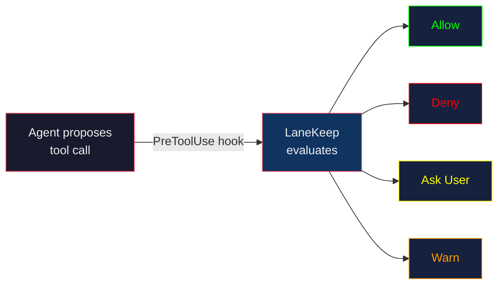

## Evaluation Pipeline

First deny stops the pipeline.

| Tier | Evaluator | What it checks |
|------|-----------|----------------|
| 0 | Config Integrity | Config hash unchanged since startup |
| 0.5 | Schema | Tool against TaskSpec allowlist/denylist |
| 1 | Hardblock | Fast substring match — always runs |
| 2 | Rules Engine | Policies, first-match-wins rules |
| 3 | Hidden Text | CSS/ANSI injection, zero-width chars |
| 4 | Input PII | PII in tool input (SSNs, credit cards) |
| 5 | Budget | Action count, token tracking, wall-clock time |
| 6 | Plugins | Custom evaluators (subshell isolated) |
| 7 | Semantic | LLM-based intent check (opt-in) |
| Post | ResultTransform | Secrets/injection in output |

See [CLAUDE.md](CLAUDE.md) for detailed tier descriptions and data flow.

## Configuration

Everything is configurable — built-in defaults, user-defined rules, and
community-sourced packs all merge into a single policy. Override any default,
add your own rules, or disable what you don't need.

Config resolves: `$PROJECT_DIR/lanekeep.json` -> `$LANEKEEP_DIR/defaults/lanekeep.json`.
Config is hash-checked at startup — mid-session modifications deny all calls.

### Rules

Ordered first-match-wins table. No match = allow. Match fields use AND logic.

```json
[
  {"match": {"command": "rm", "target": "node_modules"}, "decision": "allow"},
  {"match": {"command": "rm -rf"},                        "decision": "deny"}
]
```

You don't need to copy the full defaults. Use `"extends": "defaults"` and add your rules:

```json
{
  "extends": "defaults",
  "extra_rules": [
    {
      "id": "my-001",
      "match": { "command": "docker compose down" },
      "decision": "deny",
      "reason": "Block tearing down the dev stack"
    }
  ]
}
```

Or use the CLI:

```bash
lanekeep rules add --match-command "docker compose down" --decision deny --reason "..."
```

### Enforcement Profiles

| Profile | Behavior |
|---------|----------|
| `strict` | Denies Bash, asks for Write/Edit. 50 actions, 15 min. |
| `guided` | Asks for `git push`. 200 actions, 1 hour. **(default)** |
| `autonomous` | Permissive, budget + trace only. 500 actions, 2 hours. |

Set via `LANEKEEP_PROFILE` env var or `"profile"` in `lanekeep.json`.

### Policies

Evaluated before rules. 20 built-in categories — each with dedicated extraction
logic (e.g. `domains` parses URLs, `branches` extracts branch names from git
commands). Categories: `tools`, `extensions`, `paths`, `commands`, `domains`,
`mcp_servers`, and more. Toggle with `lanekeep policy`.

**Policies vs Rules:** Policies are structured, typed controls for predefined
categories. Rules are the flexible catch-all — they match any tool name + any
regex pattern against the full tool input. If your use case doesn't fit a policy
category, write a rule instead.

See [REFERENCE.md](REFERENCE.md) for rule fields, policy categories, settings,
and environment variables.

## CLI Reference

```bash
lanekeep init [dir]          # Initialize in a project
lanekeep start               # Start sidecar + dashboard
lanekeep serve [--spec FILE] # Start sidecar only
lanekeep demo                # Run demo
lanekeep trace [--follow]    # View / live tail audit log
lanekeep trace clear --older-than 7d
lanekeep audit               # Validate config
lanekeep rules list          # List active rules
lanekeep rules test "CMD"    # Dry-run: which rule matches?
lanekeep rules validate      # Check rules for errors
lanekeep rules add [opts]    # Add a custom rule
lanekeep rules export/import # Portable rule transfer
lanekeep rules update        # Fetch latest defaults
lanekeep policy status       # Show policy status
lanekeep policy disable <cat> --reason "..."
lanekeep stop                # Graceful shutdown
lanekeep status              # Show sidecar status
lanekeep selftest            # Built-in self-test
lanekeep ui                  # Web dashboard
lanekeep migrate             # Migrate config format
lanekeep bookmarks           # Manage bookmarks
lanekeep-scan <dir>          # Scan plugins for issues
lanekeep-parse-spec <file>   # Parse PRP to TaskSpec
```

## Dashboard

See exactly what your agent is doing while it builds. Every file it touches,
every token it burns, every rule it triggers — live, in one place. No
guessing what happened after the fact; watch the decisions, the budget, and
the file activity as your session runs.

### Governance

Session and all-time stats at a glance: action count, token usage, context
window consumption, wall-clock time — each with a progress bar against your
budget limits. Plus the full config stack showing which layers are loaded and
your config integrity hash.

<p align="center">
  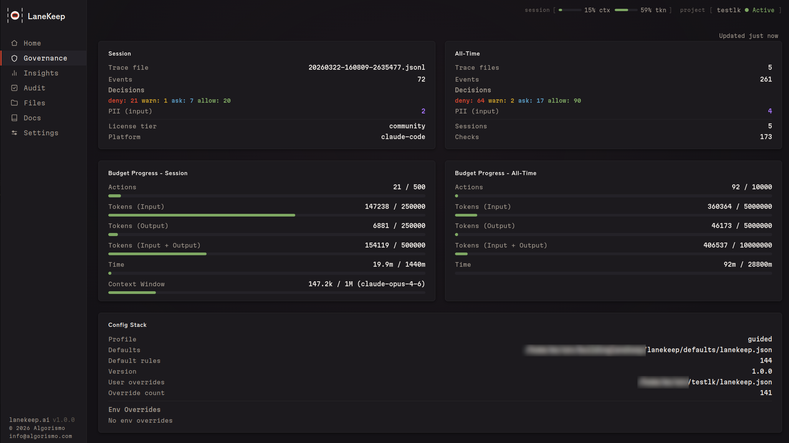
</p>

### Insights

Live decision feed with trends over time. See which tools get denied most,
which evaluators fire, per-file read/write activity, check latency
percentiles, and a decision timeline across your session.

<p align="center">
  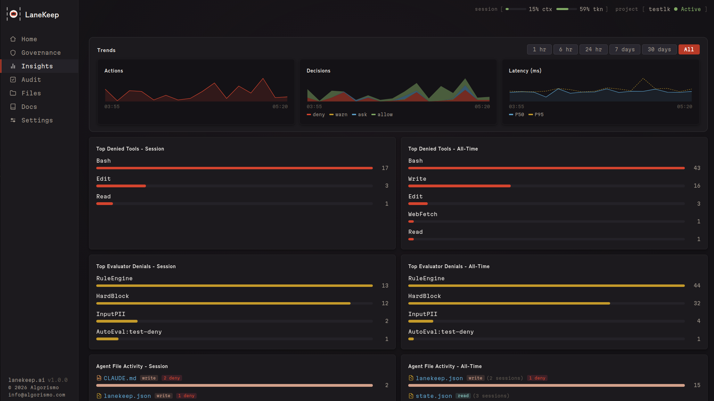
</p>
<p align="center">
  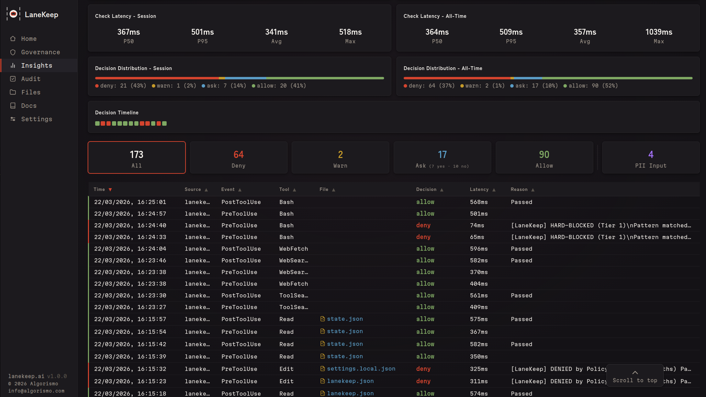
</p>

### Audit & Coverage

One-click config validation. Checks your policies, rules, and security
posture — flags misconfigurations, missing coverage, and integrity issues.

The Coverage tab maps rules and evaluators to regulatory frameworks
(PCI-DSS, HIPAA, GDPR, NIST SP800-53, SOC2, OWASP, CWE, AU Privacy Act).
It shows three things:

- **Summary cards** — framework count, mapped requirements, coverage gaps,
  and total evidence events drawn from the audit trace.
- **Evidence chain** — a three-column visualization linking frameworks →
  requirements → the rules that enforce them. Requirements with no
  backing rule are highlighted as coverage gaps.
- **Rule impact analysis** — select any rule to see its blast radius:
  which compliance requirements it satisfies, total and 30-day denial
  counts, and which files it has protected.

<p align="center">
  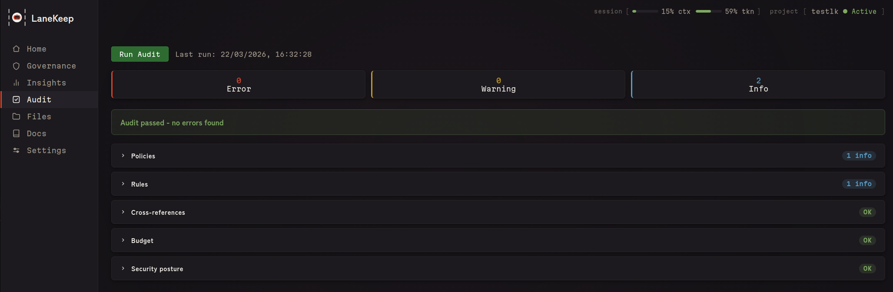
</p>
<p align="center">
  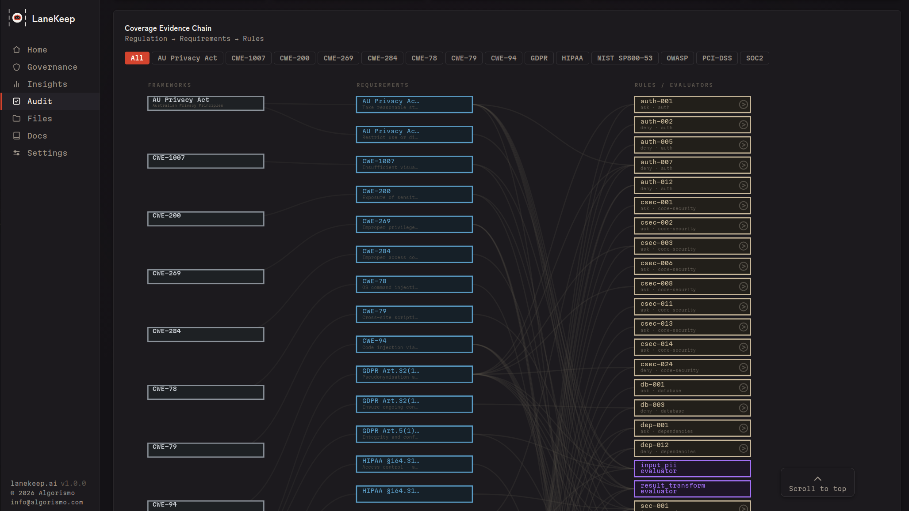
</p>
<p align="center">
  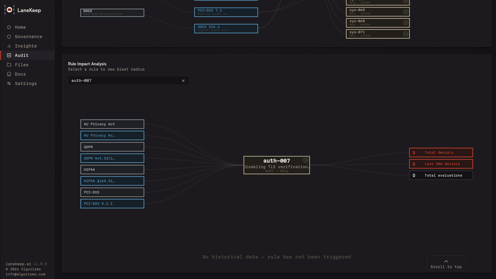
</p>

Rules gain coverage tags through the `compliance` field in `lanekeep.json`
(or via the Rules editor in the dashboard). Evaluators contribute tags via
`evaluators.<name>.compliance_by_category`.

### Files

Every file your agent reads or writes, with operation counts, token tracking,
and denial history. Bookmark frequently-edited files for quick access. Open
any file in the inline editor to inspect what changed.

<p align="center">
  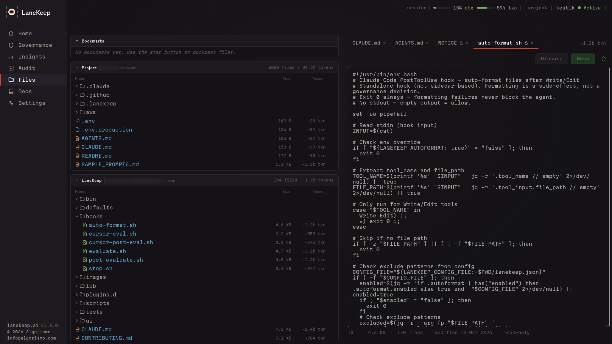
</p>

## Security

**LaneKeep runs entirely on your machine. No cloud, no telemetry, no account.**

- **Config integrity** — hash-checked at startup; mid-session changes deny all calls
- **Fail-closed** — any evaluation error results in a deny
- **Immutable TaskSpec** — session contracts can't be changed after startup
- **Plugin sandboxing** — subshell isolation, no access to LaneKeep internals
- **Append-only audit** — trace logs can't be altered by the agent
- **No network dependency** — pure Bash + jq, no supply chain

See [SECURITY.md](SECURITY.md) for vulnerability reporting.

## Development

See [CLAUDE.md](CLAUDE.md) for architecture and conventions. Run tests with
`bats tests/` or `lanekeep selftest`. Cursor adapter included (untested).

## License

[Apache License 2.0](LICENSE)

---

<div align="center">

### Interested in building with us?

<table><tr><td>
<p align="center">
<strong>We are looking for ambitious engineers to help us extend the capabilities of LaneKeep.</strong><br/>
Is this you? <strong>Get in touch &rarr;</strong> <a href="mailto:info@algorismo.com"><code>info@algorismo.com</code></a>
</p>
</td></tr></table>

</div>
