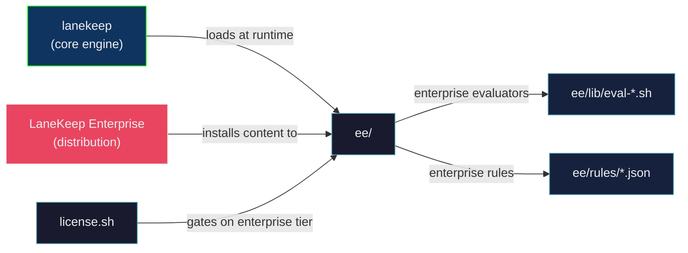

# LaneKeep Enterprise Edition

This directory is the runtime mount point for Enterprise-tier features. It is
present in the public repo as an empty scaffold — Enterprise content is installed
here by the LaneKeep Enterprise distribution.

```
ee/
  lib/     Enterprise evaluator modules (sourced by lanekeep-handler at startup)
  rules/   Enterprise rule definitions (loaded by config.sh at serve time)
```



## Tier Mapping

| Content | Community | Pro | Enterprise |
|---------|:---------:|:---:|:----------:|
| 144 default rules | ✓ | ✓ | ✓ |
| Community pack installs (`lanekeep rules install`) | ✓ | ✓ | ✓ |
| Compliance tag overlays (`lanekeep-pro/packs/`) | — | ✓ | ✓ |
| Enterprise evaluators (`ee/lib/`) | — | — | ✓ |
| Enterprise rules (`ee/rules/`) | — | — | ✓ |
| SSO/SAML + RBAC | — | — | ✓ |
| Org-wide policy sync | — | — | ✓ |

## How It Works

- **Pro content** (`compliance_tags` overlays) is loaded from `lanekeep-pro/packs/`
  by `load_pro_packs()` in `lib/config.sh`. Active for both `pro` and `enterprise`.
- **Enterprise content** (`ee/`) is loaded only when
  `LANEKEEP_LICENSE_TIER=enterprise`:
  - `ee/rules/*.json` — merged into the rule pipeline by `load_enterprise_rules()`
    in `lib/config.sh`. Each file must contain `{"tier": "enterprise", "rules": [...]}`.
    Rules require a valid Ed25519 signature (same scheme as Pro packs).
  - `ee/lib/eval-*.sh` — sourced by `lanekeep-handler` after the standard
    evaluator chain. Evaluators follow the same protocol as `lib/eval-*.sh`.

## For Enterprise Pack Authors

Rule files in `ee/rules/` must:
- Contain `{"tier": "enterprise", "rules": [...]}` with standard rule schema
- Be signed with `lanekeep-pro/bin/sign-pack` before distribution
- Use rule IDs prefixed with `ee-` (e.g. `ee-rbac-001`)

Evaluators in `ee/lib/` must:
- Be named `eval-<name>.sh`
- Follow the evaluator protocol (see `lib/eval-hardblock.sh` for reference)
- Be idempotent — sourced on every request

## References

- [DISTRIBUTION.md](../lanekeep-pro/DISTRIBUTION.md) — signing workflow
- [ROADMAP.md](../ROADMAP.md) — pricing tiers and feature matrix
