<p align="center">
  <picture>
    <source media="(prefers-color-scheme: dark)" srcset="../images/lanekeep-logo-mark.svg" />
    <source media="(prefers-color-scheme: light)" srcset="../images/lanekeep-logo-mark-light.svg" />
    
  </picture>
</p>

<p align="center">
  <a href="../LICENSE"></a>
  <a href="https://github.com/algorismo-au/lanekeep/actions/workflows/test.yml"></a>
  
  
  
  
  <a href="../SECURITY.md"></a>
</p>

<p align="center">
  <a href="../README.md">English</a> ·
  <a href="README.zh-CN.md">简体中文</a> ·
  <a href="README.ja.md">日本語</a> ·
  <a href="README.es.md">Español</a> ·
  <a href="README.ko.md">한국어</a> ·
  <a href="README.pt-BR.md">Português</a> ·
  <a href="README.de.md">Deutsch</a> ·
  <a href="README.fr.md">Français</a> ·
  <a href="README.ru.md">Русский</a> ·
  <a href="README.tr.md">Türkçe</a> ·
  <a href="README.ar.md">العربية</a> ·
  <a href="README.vi.md">Tiếng Việt</a> ·
  <a href="README.it.md">Italiano</a> ·
  <a href="README.hi.md">हिन्दी</a> ·
  <a href="README.ta.md">தமிழ்</a> ·
  <a href="README.fa.md">فارسی</a> ·
  <a href="README.id.md">Bahasa Indonesia</a> ·
  <a href="README.pl.md">Polski</a>
</p>

<p align="center"><sub>Zbudowane przez <a href="https://www.algorismo.com">Algorismo</a></sub></p>

# LaneKeep

Agenci AI do pisania kodu wpisują `rm -rf`, czytają pliki `.env`, pushują do niewłaściwej gałęzi i spalają tokeny w niekontrolowanych pętlach. **LaneKeep przechwytuje każde wywołanie narzędzia i egzekwuje deterministyczne reguły, zanim zostanie ono wykonane.**

**173 reguły domyślne · 17 ewaluatorów · zero wywołań sieciowych · Apache 2.0**

- **Panel na żywo:** każda decyzja logowana lokalnie
- **Limity budżetu:** wzorce użycia, limity kosztów, limity tokenów i akcji
- **Pełny ślad audytowy:** każde wywołanie narzędzia zapisane z pasującą regułą i uzasadnieniem
- **Obrona w głębi:** rozszerzalne warstwy polityk: 17 deterministycznych ewaluatorów oraz opcjonalna warstwa semantyczna (kolejny LLM) jako ewaluator; wykrywanie danych osobowych (PII), kontrola integralności konfiguracji i wykrywanie prompt injection
- **Podgląd pamięci/wiedzy agenta:** zobacz to, co widzi twój agent
- **Pokrycie i zgodność:** wbudowane tagi zgodności (NIST, OWASP, CWE, ATT&CK); możesz dodać własne
- **Żadne dane nie opuszczają twojej maszyny.** Każdą politykę i regułę kontrolujesz ty.

Obsługuje Claude Code CLI na Linuksie, macOS i Windowsie (przez WSL lub Git Bash). Wsparcie kolejnych platform wkrótce.

Więcej szczegółów w sekcji [Konfiguracja](#konfiguracja).

<p align="center">
  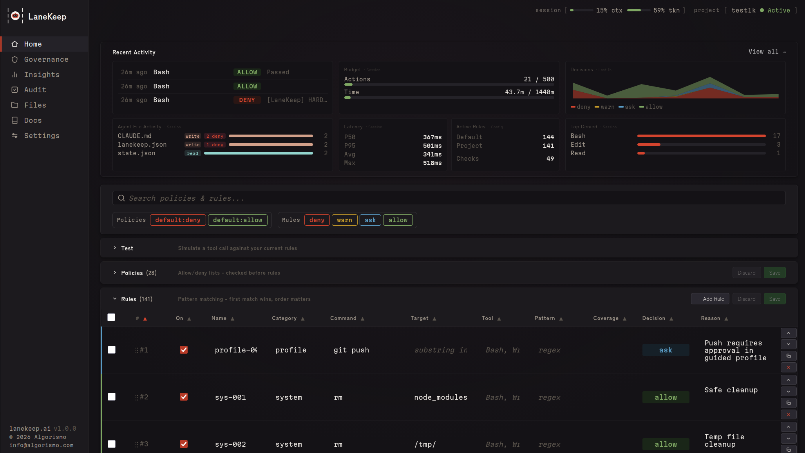
</p>

## Szybki start

### Wymagania wstępne

| Zależność | Wymagana | Uwagi |
|-----------|----------|-------|
| **bash** >= 4 | tak | Podstawowe środowisko uruchomieniowe |
| **jq** | tak | Przetwarzanie JSON |
| **socat** | dla trybu sidecar | Niepotrzebny w trybie tylko-hooki |
| **Python 3** | opcjonalnie | Panel webowy (`lanekeep ui`) |

```bash
sudo apt install jq socat        # Debian/Ubuntu
brew install bash jq socat       # macOS (bash 4+ required)
sudo apt install jq socat        # Windows (inside WSL)
```

### Instalacja

```bash
git clone https://github.com/algorismo-au/lanekeep.git
cd lanekeep
```

Dodaj `bin/` do PATH na stałe:

```bash
bash scripts/add-to-path.sh
```

Wykrywa twoją powłokę i zapisuje do pliku rc. Idempotentne.

Albo tylko dla bieżącej sesji:

```bash
export PATH="$PWD/bin:$PATH"
```

Bez etapu budowania. Czysty Bash.

### 1. Wypróbuj demo

```bash
lanekeep demo
```

```
  DENIED  rm -rf /              Recursive force delete
  DENIED  DROP TABLE users      SQL destruction
  DENIED  git push --force      Dangerous git operation
  ALLOWED ls -la                Safe directory listing
  Results: 4 denied, 2 allowed
```

### 2. Zainstaluj w swoim projekcie

```bash
cd /path/to/your/project
lanekeep init .
```

Tworzy `lanekeep.json`, `.lanekeep/traces/` i instaluje hooki w `.claude/settings.local.json`.

### 3. Uruchom LaneKeep

```bash
lanekeep start       # sidecar + web dashboard
lanekeep serve       # sidecar only
# or skip both — hooks evaluate inline (slower, no background process)
```

### 4. Używaj swojego agenta normalnie

Odrzucone akcje pokazują uzasadnienie. Dozwolone akcje wykonują się po cichu. Decyzje przeglądaj w **[panelu](#panel)** (`lanekeep ui`) albo z terminala poleceniami `lanekeep trace` / `lanekeep trace --follow`.

| | |
|:---:|:---:|
| 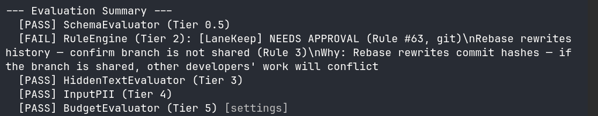 | 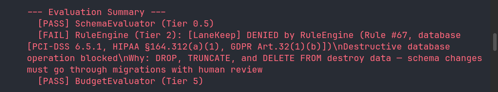 |
| 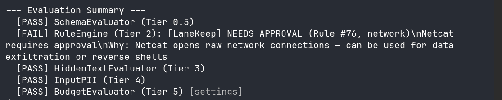 | 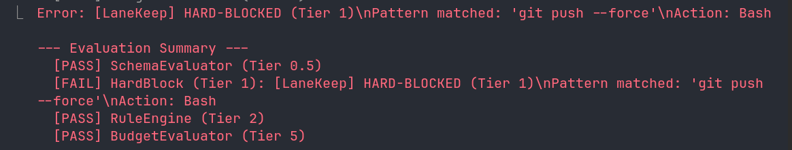 |
| 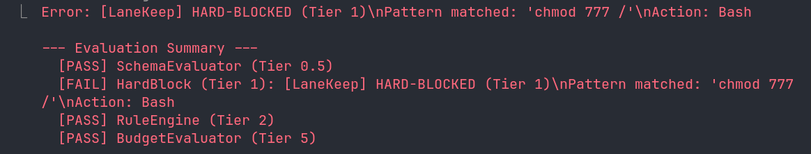 | 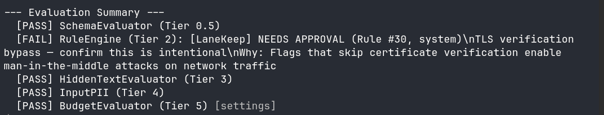 |

---

## Zarządzanie LaneKeep

### Włączanie i wyłączanie

`lanekeep init` rejestruje hooki automatycznie, ale możesz zarządzać ich rejestracją osobno:

```bash
lanekeep enable          # Register hooks in Claude Code settings
lanekeep disable         # Remove hooks from Claude Code settings
lanekeep status          # Check if LaneKeep is active and show governance state
```

**Zrestartuj Claude Code po `enable` lub `disable`, aby zmiany zaczęły obowiązywać.**

`enable` zapisuje trzy hooki (PreToolUse, PostToolUse, Stop) do pliku ustawień Claude Code:
projektowego `.claude/settings.local.json`, jeśli istnieje, w przeciwnym razie
`~/.claude/settings.json`. `disable` czysto je usuwa.

### Uruchamianie i zatrzymywanie

Same hooki działają: każde wywołanie narzędzia jest oceniane inline. Sidecar dodaje
trwały proces w tle dla szybszej oceny oraz panel webowy:

```bash
lanekeep start           # Sidecar + web dashboard (recommended)
lanekeep serve           # Sidecar only (no dashboard)
lanekeep stop            # Shut down sidecar and dashboard
lanekeep status          # Check running state
```

### Tymczasowe wyłączanie LaneKeep

Są dwa poziomy „wyłączenia”:

| Zakres | Polecenie | Co robi |
|--------|-----------|---------|
| **Cały system** | `lanekeep disable` | Usuwa wszystkie hooki. Żadna ocena się nie odbywa. Zrestartuj Claude Code. |
| **Jedna polityka** | `lanekeep policy disable <category> --reason "..."` | Wyłącza pojedynczą kategorię polityk (np. `governance_paths`), a reszta pozostaje egzekwowana. |

Aby wstrzymać jedną politykę i włączyć ją ponownie:

```bash
lanekeep policy disable governance_paths --reason "Updating CLAUDE.md"
# ... make changes ...
lanekeep policy enable governance_paths
```

Aby całkowicie wyłączyć LaneKeep i przywrócić go z powrotem:

```bash
lanekeep disable         # Remove hooks — restart Claude Code
# ... work without governance ...
lanekeep enable          # Re-register hooks — restart Claude Code
```

---

## Co zostaje zablokowane

Zobacz [Konfigurację](#konfiguracja), aby nadpisać, rozszerzyć lub wyłączyć cokolwiek.

| Kategoria | Przykłady | Decyzja |
|-----------|-----------|---------|
| Operacje destrukcyjne | `rm -rf`, `DROP TABLE`, `truncate`, `mkfs` | deny |
| IaC / chmura | `terraform destroy`, `aws s3 rm`, `helm uninstall` | deny |
| Niebezpieczne git | `git push --force`, `git reset --hard` | deny |
| Sekrety w kodzie | klucze AWS, klucze API, klucze prywatne | deny |
| Pliki zarządzające | `claude.md`, `.claude/`, `lanekeep.json`, `.lanekeep/`, `plugins.d/` | deny |
| Samoochrona | `kill lanekeep-serve`, `export LANEKEEP_FAIL_POLICY` | deny |
| Komendy sieciowe | `curl`, `wget`, `ssh` | ask |
| Instalacje pakietów | `npm install`, `pip install` | ask |

### Samoochrona

LaneKeep chroni sam siebie oraz pliki zarządzające agenta przed modyfikacją przez
agenta, którym zarządza. Bez tego skompromitowany lub podatny na prompt injection
agent mógłby wyłączyć egzekucję, sfałszować logi audytowe albo obejść limity budżetu.

| Ścieżka | Co chroni |
|---------|-----------|
| `claude.md`, `.claude/` | Instrukcje, ustawienia, hooki i pamięć Claude Code |
| `lanekeep.json`, `.lanekeep/` | Konfiguracja, reguły, ślady i stan runtime LaneKeep |
| `lanekeep/bin/`, `lib/`, `hooks/` | Kod źródłowy LaneKeep |
| `plugins.d/` | Ewaluatory pluginów |

**Zapis** jest blokowany przez politykę `governance_paths` (narzędzia Write/Edit).
**Odczyt** aktywnej konfiguracji (`lanekeep.json`, pliki stanu `.lanekeep/`)
jest blokowany przez reguły `sec-039` i `sec-040`. Ujawnienie zestawu reguł pozwoliłoby
agentowi na inżynierię wsteczną wzorców dopasowania i tworzenie obejść. Kod źródłowy
LaneKeep (`bin/`, `lib/`) pozostaje czytelny; bezpieczeństwo silnika jest otwarte, ale
aktywna konfiguracja jest nieprzejrzysta dla zarządzanego agenta. Szczegóły w
[REFERENCE.md](../REFERENCE.md#self-protection-governance_paths--rules).

---

## Jak to działa

Podpina się pod [hook PreToolUse](https://docs.anthropic.com/en/docs/claude-code/hooks) i przepuszcza każde wywołanie narzędzia przez warstwowy potok przed wykonaniem. Pierwsza decyzja deny zatrzymuje potok.

| Warstwa | Ewaluator | Co sprawdza |
|---------|-----------|-------------|
| 0 | Config Integrity | Hash konfiguracji niezmieniony od startu |
| 0.5 | Schema | Narzędzie względem allowlist/denylist z TaskSpec |
| 1 | Hardblock | Szybkie dopasowanie podciągu; zawsze się wykonuje |
| 2 | Rules Engine | Polityki, reguły na zasadzie first-match-wins |
| 3 | Hidden Text | Injection CSS/ANSI, znaki o zerowej szerokości |
| 4 | Input PII | PII we wejściu narzędzia (numery SSN, karty kredytowe) |
| 5 | Budget | Liczba akcji, śledzenie tokenów, limity kosztów, czas zegarowy |
| 6 | Plugins | Własne ewaluatory (izolacja subshell) |
| 7 | Semantic | LLM-owa kontrola intencji: rozbieżność z celem, naruszenie ducha zadania, zamaskowana eksfiltracja (opt-in) |
| Post | ResultTransform | Sekrety/injection w wyjściu |

Ewaluator Semantic czyta cel zadania z TaskSpec. Ustaw go poleceniem
`lanekeep serve --spec DESIGN.md` albo zapisz bezpośrednio `.lanekeep/taskspec.json`.

**TaskSpec vs konfiguracja, w skrócie:** pola TaskSpec nadpisują `lanekeep.json`
per-sesja, a **pominięte pola dziedziczą** wartość domyślną z konfiguracji — TaskSpec
może zawężać tylko to, na czym mu zależy. Rekomendowany wzorzec to
**allow-lista w TaskSpec, deny-lista w konfiguracji**: używaj `allowed_tools` w
TaskSpec, aby zawęzić to, co jedno zadanie może zrobić, a wszystkie deny obowiązujące
w projekcie umieszczaj w top-level `denied_tools` w `lanekeep.json` (albo jako reguły
dopasowań warunkowych). Obie warstwy są egzekwowane przez ewaluator Schema —
deny-listy się sumują, allow-listy się przecinają. Zobacz
[TaskSpec Resolution & Override Semantics](../REFERENCE.md#taskspec-resolution--override-semantics)
w REFERENCE dla łańcucha scalania i szczegółów `LANEKEEP_TASKSPEC_FILE`.

Zobacz [CLAUDE.md](../CLAUDE.md), aby poznać szczegółowe opisy warstw i przepływ danych.

## Kluczowe pojęcia

| Termin | Co to jest |
|--------|-----------|
| **Event** | Surowe wystąpienie wywołania narzędzia: jeden rekord na jeden odpał hooka (`PreToolUse` lub `PostToolUse`). `total_events` zawsze rośnie, niezależnie od wyniku. |
| **Evaluation** | Pojedyncza kontrola w potoku. Każdy moduł ewaluatora (`eval-hardblock.sh`, `eval-rules.sh`, `eval-budget.sh` itd.) niezależnie analizuje event i ustawia `EVAL_PASSED`/`EVAL_REASON`. Jeden event uruchamia wiele ewaluacji; wyniki są zapisywane w tablicy `evaluators[]` śladu z polami `name`, `tier` i `passed`. |
| **Decision** | Ostateczny werdykt potoku: `allow`, `deny`, `warn` albo `ask`. Zapisywany w polu `decision` każdego wpisu śladu i zliczany w `decisions.deny / warn / ask / allow` w metrykach kumulatywnych. |
| **Action** | Event, w którym narzędzie faktycznie się wykonało (`allow` lub `warn`). Odrzucone i oczekujące na potwierdzenie wywołania się nie liczą. `action_count` to to, co mierzy `budget.max_actions`; gdy osiągnie limit, ewaluator budżetu zaczyna blokować. |

```
Event (raw hook call)
  └── Evaluations (N checks run against it)
        └── Decision (single verdict: allow/deny/warn/ask)
              └── Action (only if tool actually ran; counts against max_actions)
```

---

## Konfiguracja

Wszystko jest konfigurowalne: wbudowane wartości domyślne, reguły użytkownika i
paczki od społeczności — wszystko scala się w jedną politykę. Nadpisuj dowolne
wartości domyślne, dodawaj własne reguły albo wyłączaj to, czego nie potrzebujesz.

Konfiguracja jest rozstrzygana: `$PROJECT_DIR/lanekeep.json` -> `$LANEKEEP_DIR/defaults/lanekeep.json`.
Hash konfiguracji jest sprawdzany przy starcie; modyfikacje w trakcie sesji powodują odrzucenie wszystkich wywołań.

### Polityki

Oceniane przed regułami. 21 wbudowanych kategorii, każda z dedykowaną logiką
ekstrakcji (np. `domains` parsuje URL-e, `branches` wyciąga nazwy gałęzi git).
Kategorie: `tools`, `extensions`, `paths`, `commands`, `domains`,
`mcp_servers` i inne. Przełączaj poleceniem `lanekeep policy` albo z zakładki **Governance** w panelu.

**Polityki vs reguły:** Polityki to strukturalne, typowane kontrole dla wstępnie
zdefiniowanych kategorii. Reguły są elastycznym mechanizmem awaryjnym: dopasowują
dowolną nazwę narzędzia + dowolny wzorzec regex do całego wejścia narzędzia. Jeśli
twój przypadek użycia nie mieści się w kategorii polityki, napisz regułę.

Aby tymczasowo wyłączyć politykę (np. żeby zaktualizować `CLAUDE.md`):

```bash
lanekeep policy disable governance_paths --reason "Updating CLAUDE.md"
# ... make changes ...
lanekeep policy enable governance_paths
```

### Reguły

Uporządkowana tabela first-match-wins. Brak dopasowania = allow. Pola dopasowania używają logiki AND.

```json
[
  {"match": {"command": "rm", "target": "node_modules"}, "decision": "allow"},
  {"match": {"command": "rm -rf"},                        "decision": "deny"}
]
```

Nie musisz kopiować całych domyślnych. Użyj `"extends": "defaults"` i dodaj swoje reguły:

```json
{
  "extends": "defaults",
  "extra_rules": [
    {
      "id": "my-001",
      "match": { "command": "docker compose down" },
      "decision": "deny",
      "reason": "Block tearing down the dev stack"
    }
  ]
}
```

`extra_rules` są **doklejane na początek** rozstrzygniętego zestawu reguł, więc przy first-match-wins mają pierwszeństwo nad nakładającymi się regułami domyślnymi. Aby zmienić lub wyłączyć regułę domyślną po id (bez jej kopiowania), użyj bloku `overrides` — zobacz REFERENCE.md § Customizing Default Rules.

Albo użyj CLI:

```bash
lanekeep rules add --match-command "docker compose down" --decision deny --reason "..."
```

Reguły można również dodawać, edytować i wykonywać dry-run w zakładce **Rules** panelu, albo najpierw przetestować z CLI:

```bash
lanekeep rules test "docker compose down"
```

### Aktualizowanie LaneKeep

Kiedy zainstalujesz nową wersję LaneKeep, nowe reguły domyślne stają się aktywne automatycznie. **Twoje modyfikacje (`extra_rules`, `rule_overrides`, `disabled_rules`) nigdy nie są ruszane.**

Przy pierwszym starcie sidecara po aktualizacji zobaczysz jednorazowy komunikat:

```
[LaneKeep] Updated: v1.2.0 → v1.3.0 — 8 new default rule(s) now active.
[LaneKeep] Run 'lanekeep rules whatsnew' to review. Your customizations are preserved.
```

Aby zobaczyć dokładnie, co się zmieniło:

```bash
lanekeep rules whatsnew
# Shows new/removed rules with IDs, decisions, and reasons

lanekeep rules whatsnew --skip net-019   # Opt out of a specific new rule
lanekeep rules whatsnew --acknowledge    # Record current state (clears future notices)
```

> **Używasz monolitycznej konfiguracji?** (bez `"extends": "defaults"`) Nowe reguły domyślne nie zostaną
> scalone automatycznie. Uruchom `lanekeep migrate`, aby przekonwertować do formatu warstwowego,
> zachowując wszystkie swoje modyfikacje w nienaruszonej postaci.

### Profile egzekwowania

| Profil | Zachowanie |
|--------|-----------|
| `strict` | Odrzuca Bash, pyta o Write/Edit. 500 akcji, 2,5 godziny. |
| `guided` | Pyta o `git push`. 2000 akcji, 10 godzin. **(domyślny)** |
| `autonomous` | Permisywny, tylko budżet + ślad. 5000 akcji, 20 godzin. |

Ustawiane przez zmienną środowiskową `LANEKEEP_PROFILE` albo `"profile"` w `lanekeep.json`.

Zobacz [REFERENCE.md](../REFERENCE.md) dla pól reguł, kategorii polityk, ustawień
i zmiennych środowiskowych.

---

## Referencja CLI

Zobacz [REFERENCE.md: CLI Reference](../REFERENCE.md#cli-reference) dla pełnej listy poleceń.

---

## Panel

Zobacz dokładnie, co robi twój agent w trakcie pracy: decyzje na żywo, zużycie tokenów, aktywność plików i ślad audytowy — wszystko w jednym miejscu.

> **Pierwszy raz tutaj?** Zacznij od **Insights** — to feed decyzji na żywo pokazujący każde allow/deny w czasie rzeczywistym. **Governance** to miejsce, gdzie ustawiasz budżet i limity sesji, które napędzają te decyzje.

### Governance

Liczniki tokenów wejścia/wyjścia na żywo, procent użycia okna kontekstowego i paski postępu budżetu. Wyłap sesje schodzące na manowce, zanim spalą czas i pieniądze. Ustaw twarde limity akcji, tokenów i czasu, które automatycznie egzekwują się po osiągnięciu.

<p align="center">
  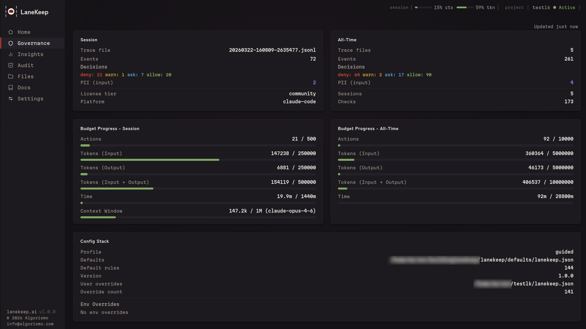
</p>

### Insights

Feed decyzji na żywo, trendy odrzuceń, aktywność per-plik, percentyle opóźnień i oś czasu decyzji w twojej sesji.

<p align="center">
  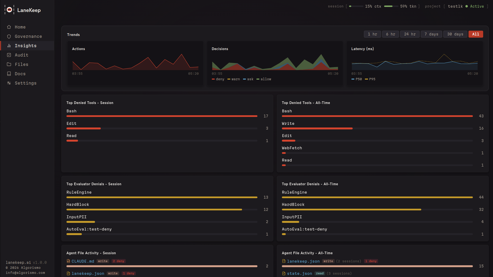
</p>
<p align="center">
  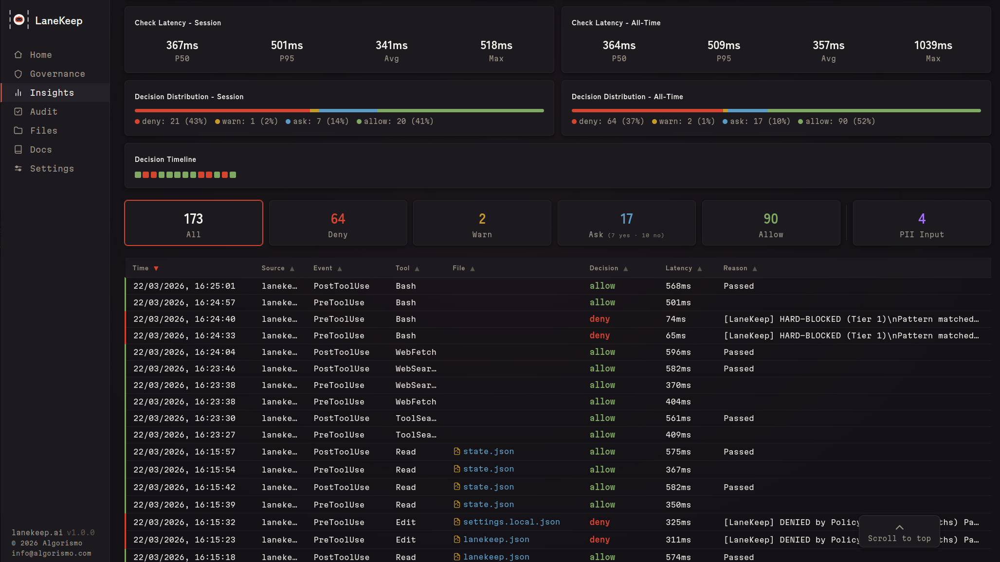
</p>
<p align="center">
  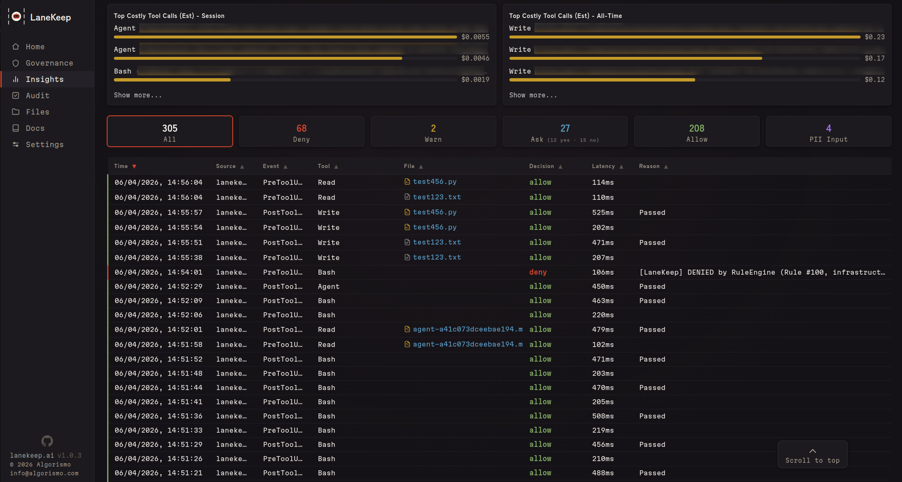
</p>

### Audit i Coverage

Walidacja konfiguracji jednym kliknięciem oraz mapa pokrycia łącząca reguły z ramami regulacyjnymi (PCI-DSS, HIPAA, GDPR, NIST SP800-53, SOC2, OWASP, CWE, AU Privacy Act), z podświetlaniem luk i analizą wpływu reguł.

<p align="center">
  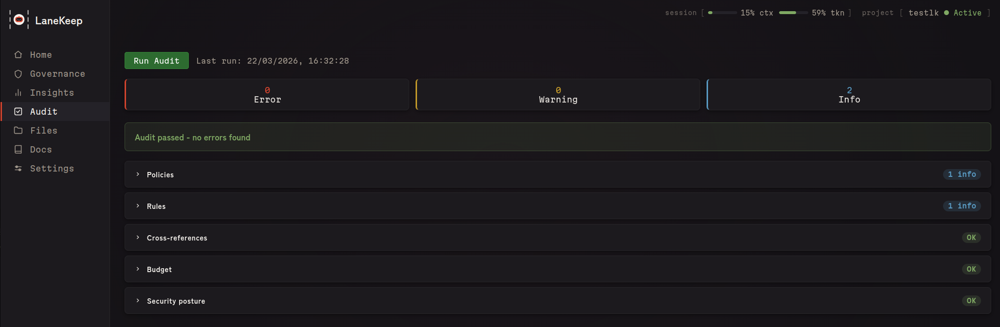
</p>
<p align="center">
  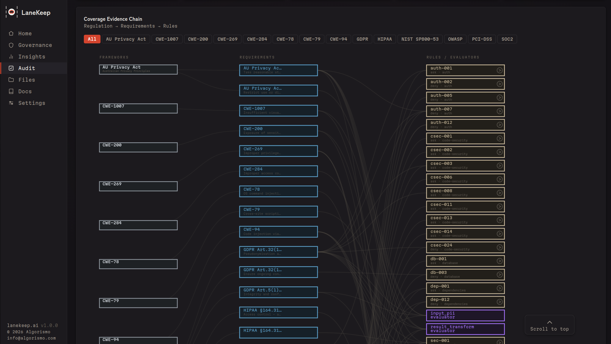
</p>
<p align="center">
  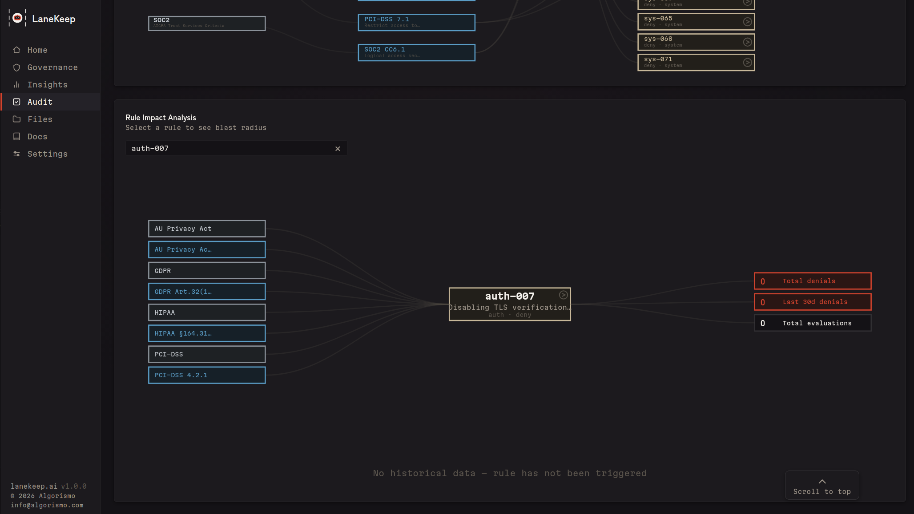
</p>

### Files

Każdy plik, który twój agent czyta lub zapisuje, z rozmiarami w tokenach per-plik, żebyś widział, co zjada okno kontekstowe. Plus liczniki operacji, historia odrzuceń i wbudowany edytor.

<p align="center">
  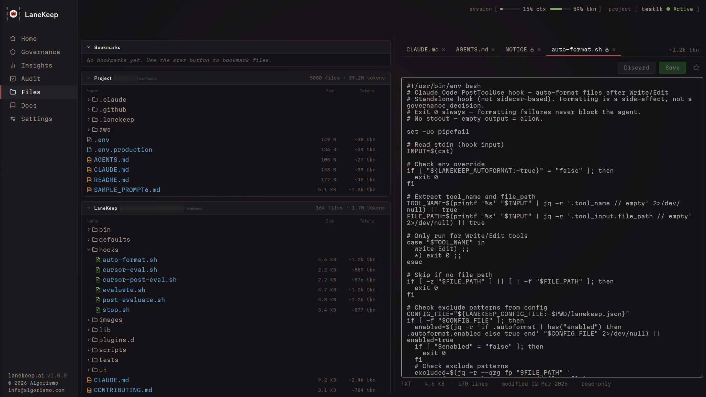
</p>

### Settings

Konfiguruj profile egzekwowania, przełączaj polityki i strojaj limity budżetu — wszystko z panelu. Zmiany działają natychmiast, bez restartu sidecara.

<p align="center">
  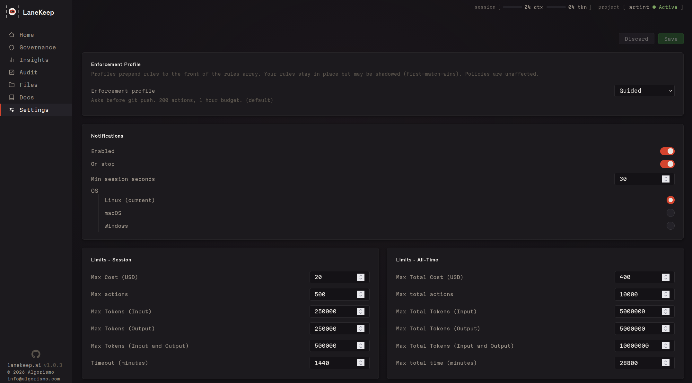
</p>
<p align="center">
  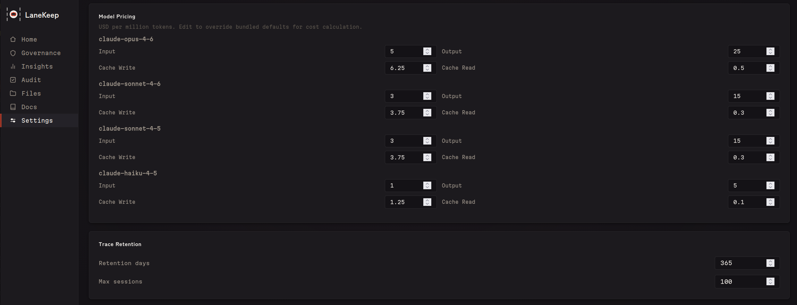
</p>
<p align="center">
  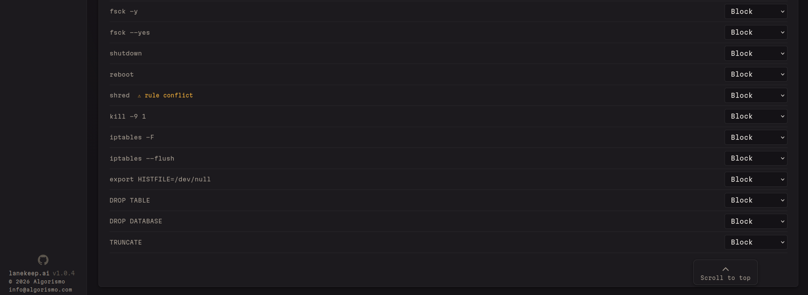
</p>

---

## Bezpieczeństwo

**LaneKeep działa w całości na twojej maszynie. Bez chmury, bez telemetrii, bez konta.**

- **Integralność konfiguracji:** hash sprawdzany przy starcie; zmiany w trakcie sesji odrzucają wszystkie wywołania
- **Fail-closed:** każdy błąd oceny skutkuje odrzuceniem
- **Niezmienialny TaskSpec:** kontrakty sesji nie mogą zostać zmienione po starcie
- **Sandboxing pluginów:** izolacja w subshellu, brak dostępu do wewnętrznych elementów LaneKeep
- **Audyt tylko-do-dopisywania:** logi śladów nie mogą zostać zmienione przez agenta
- **Brak zależności sieciowej:** czysty Bash + jq, brak łańcucha dostaw

### Prywatność śladów

Ślady JSONL w `.lanekeep/traces/` maskują sekrety przed zapisem. Potok ewaluatorów
nadal widzi surowe wejście narzędzia — tylko utrwalony rekord jest oczyszczany.

- **Otoczki `<private>...</private>`** w wejściu narzędzia są zamieniane na
  `[REDACTED:private]`. Otocz nimi wrażliwą prozę, żeby wyłączyć ją ze śladu
  audytowego bez wyłączania samego tracingu.
- **Wartości JSON, których klucz kończy się na `_KEY` / `_TOKEN` / `_SECRET` /
  `_PASSWORD`** (niewrażliwe na wielkość liter) są zamieniane na `[REDACTED:keyname]`.
- Klucze dostępu AWS, tokeny GitHub, klucze Anthropic / `sk-` oraz nagłówki
  `Bearer …` są dopasowywane wzorcem i zamieniane na
  `[REDACTED:<type>]`.

Zobacz [REFERENCE.md § Trace Privacy](../REFERENCE.md#trace-privacy) dla pełnej
mapy placeholderów.

Zobacz [SECURITY.md](../SECURITY.md) dla zgłaszania podatności.

---

## Rozwój

Zobacz [CLAUDE.md](../CLAUDE.md) dla architektury i konwencji. Uruchamiaj testy
poleceniem `bats tests/` albo `lanekeep selftest`. Adapter Cursor dołączony (nietestowany).

---

## Licencja

[Apache License 2.0](../LICENSE)

---

## Keywords

AI agent guardrails, AI agent governance, AI coding agent security, agentic AI
security, vibe coding security, AI agent policy engine, governance sidecar, AI
agent firewall, AI agent audit trail, AI agent least privilege, AI agent
sandboxing, prompt injection prevention, MCP security, MCP guardrails, Claude
Code security, Claude Code guardrails, Claude Code hooks, Cursor guardrails,
Copilot governance, Aider guardrails, AI agent monitoring, AI agent
observability, AI coding assistant safety, policy-as-code, governance-as-code,
AI agent runtime security, AI agent access control, AI agent permissions, AI
agent allowlist denylist, OWASP agentic top 10, NIST AI risk management, SOC2
AI compliance, HIPAA AI compliance, EU AI Act compliance tools, PII detection,
secrets detection, AI agent budget limits, token budget enforcement, AI agent
cost control, shadow AI governance, AI development guardrails, DevSecOps AI, AI
agent command blocking, AI agent file access control, defense in depth AI, zero
trust AI agents, fail-closed security, append-only audit log, deterministic
guardrails, rule engine AI, compliance automation AI, AI agent behavior
monitoring, AI agent risk management, open source AI governance, CLI guardrails
tool, shell-based policy engine, no-cloud AI security, zero network calls, AI
coding tool audit log

---

<div align="center">

### Chcesz budować razem z nami?

<table><tr><td>
<p align="center">
<strong>Skontaktuj się &rarr;</strong> <a href="mailto:info@algorismo.com"><code>info@algorismo.com</code></a> &middot; <a href="https://www.algorismo.com"><code>algorismo.com</code></a>
</p>
</td></tr></table>

</div>
